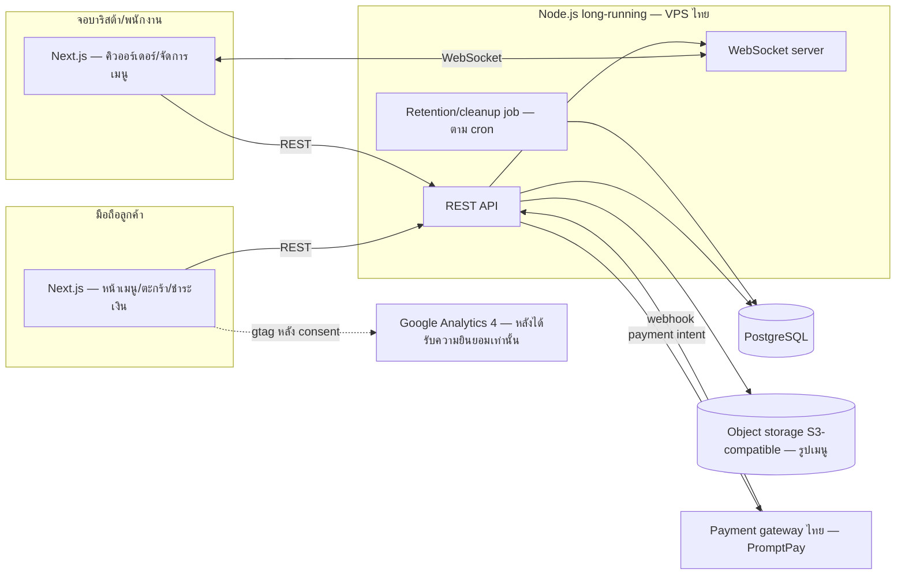

# สถาปัตยกรรมระดับสูง, API Spec, Database Schema และ Detailed Design

> ⚠️ **เอกสารนี้ยัง `ร่าง`** — ส่วนที่ผูกกับสเปค `20260802-02` (PDPA) ที่ยังมี
> เครื่องหมาย `[สมมติฐาน]` (Q1: ระดับข้อมูลส่วนบุคคลที่เก็บ, Q3: ระยะเวลาเก็บ
> ข้อมูลออร์เดอร์) ถูกออกแบบบนสมมติฐานปัจจุบันเท่านั้น และทำเครื่องหมายไว้ทุกจุด
> ที่เกี่ยวข้อง — **ห้ามพัฒนาส่วนเหล่านั้นจนกว่าจะยืนยัน**

## 1. ขอบเขตของเอกสารนี้

ออกแบบสถาปัตยกรรม, database schema, API contract, และ workflow สำคัญของ
ระบบทั้งสามสเปค — การสั่งอาหารจากโต๊ะ (`01`), PDPA/กฎหมาย IT (`02`),
คุกกี้และการวิเคราะห์การใช้งาน (`03`)

**ไม่ครอบคลุม:** เนื้อหาที่ไม่ใช่ code/schema เช่น ROPA (เอกสาร ไม่ใช่ตาราง),
กระบวนการแจ้งเหตุละเมิดข้อมูลภายใน 72 ชั่วโมง (องค์กร ไม่ใช่ระบบ), เนื้อหา
นโยบายความเป็นส่วนตัว/คุกกี้ (คอนเทนต์ ไม่ใช่โค้ด)

อ้างอิงจาก: [[20260802-01-adr-platform-stack|ADR-01]] (TypeScript/Next.js,
Node.js long-running, PostgreSQL, VPS ไทย) และ
[[20260824-02-adr-payment-gateway|ADR-02]] (PromptPay QR ผ่าน gateway ไทย)

สถานะสเปคต้นทาง ณ เวลาที่ออกแบบ: ทั้งสามฉบับ `ร่าง` — `01` ไม่มีคำถามค้างที่
กระทบสถาปัตยกรรม (Q5/Q6 เหลือแต่ไม่กระทบ), `03` ไม่มีคำถามค้างเลย, `02` มี
Q1/Q3 ที่กระทบ data model ตรง ๆ — ออกแบบต่อได้แต่ต้องทำเครื่องหมายส่วนที่ผูกกับ
สองข้อนี้ (ตามกฎของ skill นี้เอง)

## 2. ภาพรวมสถาปัตยกรรม



องค์ประกอบเดียว (Node.js process) รัน REST API และ WebSocket server ร่วมกัน —
เป็นเหตุผลหลักที่ ADR-01 เลือก long-running runtime ไม่ใช่ serverless
(AC-4 ของ `01` ต้องการ push ภายใน 5 วินาที)

## 3. เทคโนโลยีที่ใช้

| ส่วน | เลือกใช้ | เหตุผลสั้น ๆ | ADR |
| --- | --- | --- | --- |
| Frontend/Backend/DB/Hosting | ตามที่ตัดสินใจแล้ว | — | [[20260802-01-adr-platform-stack|ADR-01]] |
| Payment | PromptPay QR ผ่าน gateway ไทย | ต้องมี webhook เพื่อวัด AC-4 ได้จริง | [[20260824-02-adr-payment-gateway|ADR-02]] |
| Object storage (รูปเมนู) | S3-compatible | ผู้ใช้ยืนยันแล้ว — ไม่ใช่ข้อมูลส่วนบุคคล จึงไม่ติดข้อจำกัดเรื่องพื้นที่ตั้งเซิร์ฟเวอร์แบบเดียวกับข้อมูลลูกค้า | เอกสารนี้ (ไม่แยก ADR เพราะขอบเขตผลกระทบเล็กกว่า payment) |
| Password hashing | Argon2id | มาตรฐานปัจจุบันที่แนะนำเหนือ bcrypt สำหรับรหัสผ่านใหม่ — เป็นค่าเริ่มต้นทางเทคนิคที่ตัดสินใจได้โดยไม่ต้องรอธุรกิจ ต่างจาก payment/storage ที่มีผลทางพาณิชย์ | — |
| Reverse proxy / TLS termination | `TBD` | ยังไม่ตัดสินใจ — ดู §8 |

## 4. Database schema

### ตาราง `tables`

| คอลัมน์ | ชนิด | ข้อจำกัด | คำอธิบาย |
| --- | --- | --- | --- |
| `id` | `uuid` | PK | |
| `label` | `text` | NOT NULL | เช่น "5" |
| `qr_token` | `text` | UNIQUE, NOT NULL | ใน QR โค้ดที่พิมพ์ติดโต๊ะ |
| `zone` | `text` | NULL | `[สมมติฐาน — รอ Q5 ของสเปค 01]` จำนวนโต๊ะ/การจัดโซนยังไม่ยืนยัน |
| `created_at` | `timestamptz` | NOT NULL default now() | |

### ตาราง `menu_items`

| คอลัมน์ | ชนิด | ข้อจำกัด | คำอธิบาย |
| --- | --- | --- | --- |
| `id` | `uuid` | PK | |
| `name` | `text` | NOT NULL | |
| `price_baht` | `integer` | NOT NULL, CHECK > 0 AND <= 2000 | ตาม DESIGN.md §3 (validation ราคาเมนู, 2026-08-19) |
| `photo_url` | `text` | NULL | ชี้ไป object storage |
| `is_available` | `boolean` | NOT NULL default true | Switch เปิด/ปิดขาย (US-6, BR-3 ของ `01`) |
| `created_at`, `updated_at` | `timestamptz` | NOT NULL | |

### ตาราง `orders`

| คอลัมน์ | ชนิด | ข้อจำกัด | คำอธิบาย |
| --- | --- | --- | --- |
| `id` | `uuid` | PK | |
| `table_id` | `uuid` | NOT NULL, FK → `tables.id` | BR-1 ของ `01`: ทุกออร์เดอร์ต้องผูกโต๊ะ |
| `status` | `text` | CHECK IN ('pending_payment','confirmed','completed','cancelled') | |
| `created_at` | `timestamptz` | NOT NULL | เวลาที่ลูกค้ายืนยัน (ก่อนจ่ายเงิน) |
| `confirmed_at` | `timestamptz` | NULL | ตั้งค่าตอน webhook จ่ายเงินสำเร็จ — **AC-4 วัดจากจุดนี้ถึงเวลาที่บาริสต้าเห็น** |
| `completed_at` | `timestamptz` | NULL | ตั้งค่าตอนบาริสต้ากด "เสร็จแล้ว" (AC-6) |

### ตาราง `order_items`

| คอลัมน์ | ชนิด | ข้อจำกัด | คำอธิบาย |
| --- | --- | --- | --- |
| `id` | `uuid` | PK | |
| `order_id` | `uuid` | NOT NULL, FK → `orders.id` | |
| `menu_item_id` | `uuid` | FK → `menu_items.id` | อ้างอิงไว้แต่ไม่พึ่งค่าปัจจุบันของแถวนั้น |
| `item_name_snapshot` | `text` | NOT NULL | ชื่อ ณ เวลาสั่ง |
| `unit_price_snapshot_baht` | `integer` | NOT NULL | ราคา ณ เวลาสั่ง — **นี่คือกลไกที่ทำให้ BR-4/AC-9 ของ `01` เป็นจริง**: แก้ราคาใน `menu_items` ภายหลังไม่กระทบแถวนี้ |
| `quantity` | `integer` | NOT NULL, CHECK > 0 | |
| `options` | `jsonb` | NULL | ขนาด/ร้อนเย็น/ความหวาน/ท็อปปิ้ง — เก็บแบบ flexible เพราะ DESIGN.md §3 (Select) ยังทิ้ง "ระดับความหวาน" ไว้เป็น TBD ว่าเป็นชุดตัวเลือกหรือสเกล |
| `note_to_barista` | `text` | NULL | จากสเปค `01` §2 |

### ตาราง `payments`

| คอลัมน์ | ชนิด | ข้อจำกัด | คำอธิบาย |
| --- | --- | --- | --- |
| `id` | `uuid` | PK | |
| `order_id` | `uuid` | NOT NULL, FK → `orders.id` | ออร์เดอร์เดียวอาจมีหลายแถวถ้าจ่ายไม่สำเร็จแล้วลองใหม่ |
| `provider` | `text` | NOT NULL | ชื่อ gateway จริง (เลือกตอนพัฒนา ตาม ADR-02) |
| `provider_ref` | `text` | NULL | รหัสอ้างอิงจาก gateway |
| `amount_baht` | `integer` | NOT NULL | |
| `status` | `text` | CHECK IN ('pending','succeeded','failed') | |
| `webhook_received_at` | `timestamptz` | NULL | |
| `created_at` | `timestamptz` | NOT NULL | |

### ตาราง `staff_accounts`

| คอลัมน์ | ชนิด | ข้อจำกัด | คำอธิบาย |
| --- | --- | --- | --- |
| `id` | `uuid` | PK | |
| `name` | `text` | NOT NULL | |
| `role` | `text` | CHECK IN ('staff','owner') | BR-7 ของ `01`, BR-8 ของ `02` |
| `password_hash` | `text` | NOT NULL | Argon2id — ห้ามเก็บแบบอื่น (BR-6 ของ `02`, AC-7) |
| `created_at` | `timestamptz` | NOT NULL | |

### ตาราง `consent_records`

| คอลัมน์ | ชนิด | ข้อจำกัด | คำอธิบาย |
| --- | --- | --- | --- |
| `id` | `uuid` | PK | |
| `device_token` | `text` | NOT NULL | สร้างฝั่ง client เก็บใน localStorage — **ไม่ใช่ข้อมูลระบุตัวตนจริง** สอดคล้องกับสมมติฐานปัจจุบันของ `02` Q1 ที่ไม่เก็บ PII |
| `category` | `text` | CHECK IN ('necessary','analytics','marketing') | |
| `granted` | `boolean` | NOT NULL | |
| `policy_version` | `text` | NOT NULL | BR-10 ของ `03`, รองรับ BR-11 (เปลี่ยนนโยบายต้องขอใหม่) |
| `created_at` | `timestamptz` | NOT NULL | |

### ตาราง `traffic_logs` (append-only)

| คอลัมน์ | ชนิด | ข้อจำกัด | คำอธิบาย |
| --- | --- | --- | --- |
| `id` | `bigserial` | PK | |
| `ip_address` | `inet` | NOT NULL | **เต็ม ไม่ตัดทอน** — ฐานกฎหมายคือหน้าที่ตามกฎหมาย ไม่ใช่ความยินยอม (BR-5.1 ของ `02`) |
| `occurred_at` | `timestamptz` | NOT NULL | |
| `request_path` | `text` | NOT NULL | |
| `user_agent` | `text` | NOT NULL | |
| `staff_account_id` | `uuid` | NULL, FK → `staff_accounts.id` | ถ้ามีการเข้าสู่ระบบ |

**ห้ามมี** คอลัมน์ request/response body (BR-5.3) **ห้ามมี** UPDATE/DELETE
สิทธิ์ในระดับ DB role (BR-5.2, AC-11.3) — ใช้ database role แยกสำหรับ
connection ที่เขียนตารางนี้ ให้สิทธิ์ INSERT/SELECT เท่านั้น ไม่ให้ UPDATE/DELETE

### ตาราง `access_denials`

| คอลัมน์ | ชนิด | ข้อจำกัด | คำอธิบาย |
| --- | --- | --- | --- |
| `id` | `bigserial` | PK | |
| `staff_account_id` | `uuid` | NOT NULL, FK | |
| `action_attempted` | `text` | NOT NULL | เช่น `edit_menu_price` |
| `occurred_at` | `timestamptz` | NOT NULL | |

รองรับ AC-8 ของ `01` และ AC-9 ของ `02` (บันทึกความพยายามที่ถูกปฏิเสธ)

### ตารางที่ยังสร้างไม่ได้

**ไม่มีตาราง `customers`** — สมมติฐานปัจจุบันของสเปค `02` (Q1) คือไม่เก็บข้อมูล
ระบุตัวตนของลูกค้าเลย ผูกออร์เดอร์กับ `table_id` เท่านั้น ถ้าคำตอบจริงคือเก็บ
ชื่อ/เบอร์โทร จะต้องเพิ่มตารางนี้และแก้ `orders` เพิ่ม FK — **นี่คือการเปลี่ยนแปลง
schema ระดับใหญ่ ไม่ใช่แค่เพิ่มคอลัมน์** จึงเป็นเหตุผลที่ Q1 บล็อกงานนี้จริง ไม่ใช่
รายละเอียดเล็กน้อย

## 5. API contract

ทุก endpoint ใต้ "บาริสต้า/พนักงาน/เจ้าของร้าน" ต้องผ่าน middleware ตรวจ
`staff_accounts.role` — ถ้าไม่ผ่านให้ตอบ `403` และเขียนแถวลง `access_denials`
เสมอ (ไม่ใช่แค่ปฏิเสธเงียบ ๆ)

### สาธารณะ (ลูกค้า ไม่ต้อง auth)

| Endpoint | หน้าที่ | AC ที่เกี่ยวข้อง |
| --- | --- | --- |
| `GET /tables/{qr_token}` | เปิดจาก QR → คืนหมายเลขโต๊ะ | AC-1 (`01`) |
| `GET /menu` | รายการเมนูที่ `is_available = true` เท่านั้น | AC-2 (`01`) — ดูหมายเหตุการตีความใน §8 |
| `POST /orders` | สร้างออร์เดอร์ `status=pending_payment` — ตรวจ `is_available` ของทุกรายการ ณ เวลานี้อีกครั้ง | BR-3, AC-7 (`01`) |
| `POST /orders/{id}/payment-intent` | ขอ QR PromptPay จาก gateway | ADR-02 |
| `POST /webhooks/payments/{provider}` | gateway เรียกกลับเมื่อจ่ายสำเร็จ/ไม่สำเร็จ → ตั้ง `confirmed_at`, ส่ง WS event | AC-4, AC-5 (`01`) |
| `GET /orders/{id}` | poll สถานะ (สำรองถ้า WS ใช้ไม่ได้) | US-4 (`01`) |
| `POST /consent` | บันทึกหมวดที่ยินยอม/ปฏิเสธ พร้อม `policy_version` | AC-1–3, AC-13 (`03`) |
| `GET /consent/{device_token}` | คืนค่าที่บันทึกไว้ล่าสุด | AC-12 (`03`) |

### บาริสต้า (auth ระดับ staff ขึ้นไป)

| Endpoint | หน้าที่ | AC ที่เกี่ยวข้อง |
| --- | --- | --- |
| `WS /ws/orders` | รับ push ออร์เดอร์ใหม่แบบ realtime | AC-4 (`01`) |
| `GET /orders?status=confirmed&since=` | ดึงออร์เดอร์ค้างมาแสดงครบตอนเชื่อมต่อกลับ | แก้ปัญหา reconnect ที่ journey ของ BL-005 ทิ้งไว้เป็นคำถามค้าง — ดู §6 |
| `PATCH /orders/{id}/complete` | บาริสต้ากด "เสร็จแล้ว" | AC-6 (`01`) |

### พนักงาน/เจ้าของร้าน (auth)

| Endpoint | หน้าที่ | AC ที่เกี่ยวข้อง |
| --- | --- | --- |
| `POST /auth/login` | เข้าสู่ระบบ | BL-006 |
| `GET /menu/items` | รายการเมนู**ทั้งหมด** รวมที่ปิดขาย (ต่างจาก `GET /menu` สาธารณะ) | ดูการตีความ AC-2 ใน §8 |
| `PATCH /menu/items/{id}/availability` | สลับเปิด/ปิดขาย | US-6, BR-3 (`01`) |
| `PUT /menu/items/{id}` | แก้ชื่อ/ราคา — **ต้อง role=owner** | BR-7, AC-8, AC-9 (`01`) |
| `PATCH /orders/{id}/cancel` | ยกเลิกออร์เดอร์ (ลูกค้าทำเองไม่ได้) | BR-5 (`01`) |
| `GET /traffic-logs` | ค้นข้อมูลจราจรย้อนหลัง (role=owner) | AC-11 series (`02`) |
| `GET /access-denials` | ดูความพยายามที่ถูกปฏิเสธ | AC-9, AC-10 (`02`) — ดู gap ใน §9 |

## 6. การไหลของงานสำคัญ

### สั่งซื้อ + ชำระเงิน (happy path และการกู้คืน)

```text
1. ลูกค้าสั่ง → POST /orders (status=pending_payment)
2. POST /orders/{id}/payment-intent → ได้ QR
3. ลูกค้าจ่ายผ่าน PromptPay
4. gateway เรียก POST /webhooks/payments/{provider}
5. Handler ตรวจสอบ signature ของ webhook (ป้องกันการปลอมแจ้งจ่ายสำเร็จ)
6. อัปเดต orders.status=confirmed, confirmed_at=now()
7. ส่ง WS event ไปคิวบาริสต้า — ต้องเสร็จภายใน 5 วินาทีจากขั้น 4 (AC-4)
```

**กรณีจ่ายสำเร็จแต่บันทึกออร์เดอร์ล้ม (สเปค `01` §7):** webhook handler ต้อง
ทำงานแบบ idempotent (เช็ค `provider_ref` ซ้ำก่อนสร้างแถวใหม่) และถ้าขั้น 6 ล้ม
ต้อง retry อัตโนมัติหรือแจ้งเตือนพนักงานให้ตรวจสอบ — **ห้ามเงียบ** ตามที่สเปค
ระบุไว้ตรง ๆ

**กรณีกดยืนยันซ้ำ:** `POST /orders` ควรใช้ idempotency key จาก client
(เช่น session + timestamp) เพื่อไม่สร้างออร์เดอร์ซ้ำ

### บาริสต้าหลุดการเชื่อมต่อแล้วกลับมา

```text
1. WebSocket ขาดการเชื่อมต่อ (ตรวจจับฝั่ง client)
2. เมื่อเชื่อมต่อกลับ → เรียก GET /orders?status=confirmed&since=<เวลาสุดท้ายที่เห็น>
3. แสดงผลรวมกับสถานะ WS ปัจจุบัน — ไม่มีใบตกหล่น
```

แก้ปัญหาที่ journey ของ BL-005 ทิ้งไว้เป็นคำถามค้าง (pattern การ resync)

### บังคับสิทธิ์ (Permission State ฝั่ง backend)

```text
1. ทุก request ไปยัง endpoint staff/owner ผ่าน middleware ตรวจ role
2. role ไม่พอ → 403 + เขียนแถวลง access_denials ทันที
3. role พอ → ทำงานตามปกติ
```

นี่คือฝั่ง backend ของ Permission State pattern ที่ DESIGN.md §3 ตัดสินใจไว้แล้ว
(ซ่อนปุ่มที่ UI คือ layer 1, endpoint นี้คือ layer 2 backstop)

### โหลด Google Analytics หลังได้รับความยินยอม

```text
1. หน้าเว็บโหลด → เช็ค GET /consent/{device_token}
2. ถ้าไม่มีสถานะบันทึกไว้ → แสดง consent banner ก่อน ไม่โหลด gtag
3. ถ้ายินยอมหมวด "วิเคราะห์" → ฝัง gtag script (Consent Mode)
4. ถ้าถอนความยินยอมทีหลัง → เอา gtag ออกจาก DOM และลบคุกกี้ที่เกี่ยวข้อง
```

`traffic_logs` (ขั้นตอนคนละเรื่อง) เก็บต่อเนื่องไม่ว่าขั้นตอนนี้จะเป็นอย่างไร

## 7. การตรวจสอบย้อนกลับ (Traceability)

### สเปค `20260802-01`

| ข้อกำหนด | องค์ประกอบที่รองรับ | หมายเหตุ |
| --- | --- | --- |
| BR-1 | `orders.table_id NOT NULL` | |
| BR-2 | `orders.status` เปลี่ยนเป็น `confirmed` เฉพาะจาก webhook | |
| BR-3 | `menu_items.is_available` + ตรวจซ้ำใน `POST /orders` | |
| BR-4 | `order_items.item_name_snapshot` / `unit_price_snapshot_baht` | |
| BR-5 | ไม่มี endpoint ยกเลิกฝั่งลูกค้า, มี `PATCH /orders/{id}/cancel` ฝั่งพนักงาน | |
| BR-6 | `orders.table_id` ไม่ unique, `payments.order_id` FK | |
| BR-7 | role check บน `PUT /menu/items/{id}` | |
| AC-1 | `GET /tables/{qr_token}` | |
| AC-2 | `GET /menu` filter `is_available` | ตีความว่าหมายถึง endpoint สาธารณะ — ดู §8 |
| AC-3 | ฝั่ง client (คำนวณยอดตะกร้า) | ไม่ต้องมี API เพิ่ม |
| AC-4 | webhook → WS push, วัดจาก `confirmed_at` | |
| AC-5 | `payments.status=failed` ไม่กระทบ `orders`/ตะกร้า client | |
| AC-6 | `PATCH /orders/{id}/complete` | |
| AC-7 | ตรวจ `is_available` ซ้ำตอน `POST /orders` | |
| AC-8 | role check + `access_denials` | |
| AC-9 | `PUT /menu/items/{id}` แก้ `menu_items` เท่านั้น ไม่แก้ `order_items` เดิม | |

### สเปค `20260802-02`

| ข้อกำหนด | องค์ประกอบที่รองรับ | หมายเหตุ |
| --- | --- | --- |
| BR-1 | ไม่มีตาราง `customers` | `[สมมติฐาน — รอ Q1]` |
| BR-2 | — | เอกสาร ROPA ไม่ใช่ code, อยู่ใน BL-008 |
| BR-3 | client แสดง privacy notice ก่อนเรียก `POST /consent` | |
| BR-4 | endpoint เดียวกันสำหรับให้/ถอนความยินยอม | |
| BR-5, 5.1–5.4 | ตาราง `traffic_logs` + DB role จำกัดสิทธิ์ | |
| BR-6 | `staff_accounts.password_hash` (Argon2id) | |
| BR-7 | TLS ผ่าน reverse proxy | `TBD` — ดู §8 |
| BR-8 | role-based middleware | |
| BR-9 | `access_denials` (ครอบคลุมเฉพาะกรณีถูกปฏิเสธ) | ดู gap ใน §9 |
| BR-10 | — | กระบวนการองค์กร ไม่ใช่ schema/API |
| BR-11 | `consent_records.policy_version` | |
| BR-12 | งาน retention/anonymize ตามกำหนด | `[สมมติฐาน — รอ Q3]` |
| AC-1–3 | `POST /consent` | เกี่ยวข้องกับข้อมูลพนักงานเป็นหลักถ้า Q1 ยืนยันไม่เก็บ PII ลูกค้า — `[สมมติฐาน — รอ Q1]` |
| AC-4 | — | `[สมมติฐาน — รอ Q1]` ถ้าไม่มี PII ก็ไม่มีอะไรให้ดู |
| AC-5 | — | `[สมมติฐาน — รอ Q1]` |
| AC-6 | worker job ลบ/ทำไม่ระบุตัวตน | `[สมมติฐาน — รอ Q3]` |
| AC-7 | `password_hash` เท่านั้น ไม่มีคอลัมน์รหัสผ่านแบบอื่น | |
| AC-8 | reverse proxy redirect HTTP→HTTPS | `TBD` — ดู §8 |
| AC-9 | role check + `access_denials` | |
| AC-10 | `access_denials` | ครอบคลุมไม่เต็ม — ดู gap ใน §9 |
| AC-11, 11.1–11.4 | `traffic_logs` schema + สิทธิ์ DB | |
| AC-12 | — | ตรวจสอบเอกสาร ไม่ใช่ code |

### สเปค `20260802-03`

| ข้อกำหนด | องค์ประกอบที่รองรับ | หมายเหตุ |
| --- | --- | --- |
| BR-1 | gtag loader ตรวจ consent ก่อนฝัง script | |
| BR-2 | หมวด "จำเป็น" ไม่ผูกกับ `consent_records` เลย | |
| BR-3 | ค่าเริ่มต้น unchecked ฝั่ง UI (DESIGN.md, Checkbox) | ฝั่ง UI ไม่ใช่ backend |
| BR-4 | ปุ่มปฏิเสธ/ยอมรับ variant เดียวกัน (DESIGN.md, Button) | ฝั่ง UI |
| BR-5, 5.1 (ในเอกสารนี้เทียบเท่า BR-6 ของ `02`) | `traffic_logs.ip_address` เต็ม, ไม่ผูก `consent_records` | |
| BR-6 | GA4 `anonymize_ip` (ตั้งค่าฝั่ง GA ไม่ใช่ schema ของเรา) | |
| BR-7 | client เอา gtag ออก + ลบคุกกี้เมื่อถอนความยินยอม | |
| BR-8, BR-9 | `traffic_logs` ไม่ผูกกับ `consent_records` | |
| BR-10 | `consent_records` (time/version/category) | |
| BR-11 | เทียบ `policy_version` ที่ client เก็บกับปัจจุบัน | |
| BR-12 | เนื้อหานโยบาย ไม่ใช่ schema | |
| BR-13 | DPA กับ Google — องค์กร ไม่ใช่ code | |
| AC-1–5 | consent banner + gtag loader ที่ gate ตาม `consent_records` | |
| AC-6 | gtag ฝังทันทีหลังยินยอม (client) | |
| AC-7 | แยก gate ต่อหมวดในตัว loader | |
| AC-8 | GA4 `anonymize_ip` | นอก schema ของเรา |
| AC-9, AC-11 | `traffic_logs` ไม่ผูก `consent_records` | |
| AC-10 | client ลบ cookie + หยุดยิง GA | |
| AC-12 | `GET /consent/{device_token}` | |
| AC-13 | `consent_records` schema | |
| AC-14 | เทียบ `policy_version` | |
| AC-15, AC-16 | เนื้อหานโยบาย | นอก schema/API ของเอกสารนี้ |

**สรุปความครอบคลุม:** BR 36/36 มีแถว (10 แถวมีเครื่องหมาย `[สมมติฐาน]` หรือ
"นอก schema/API" ตามที่ระบุ) · AC 41/41 มีแถว (7 แถวมีเครื่องหมายเดียวกัน)
ไม่มีข้อใดถูกละไว้โดยไม่ระบุเหตุผล

## 8. ที่ยังตัดสินใจไม่ได้

- [ ] **สเปค `02` Q1 (ระดับข้อมูลส่วนบุคคลที่เก็บ)** — schema ทั้งหมดข้างบนออกแบบ
      บนสมมติฐาน "ไม่เก็บ PII ลูกค้าเลย" ถ้าคำตอบจริงต่างไป ต้องเพิ่มตาราง
      `customers` และแก้ FK ของ `orders` — **เปลี่ยนแปลงระดับ schema ไม่ใช่รายละเอียด**
- [ ] **สเปค `02` Q3 (ระยะเวลาเก็บข้อมูลออร์เดอร์)** — งาน retention/anonymize
      ยังออกแบบ job จริงไม่ได้จนกว่าจะรู้ตัวเลข (1 ปี/5 ปี/90 วัน)
- [ ] **AC-2 ของ `01` ตีความว่าหมายถึง `GET /menu` สาธารณะ** — ไม่ใช่หน้าจอ
      พนักงาน (ซึ่งใช้ `GET /menu/items` แยก) นี่เป็นการตีความทางเทคนิคเพื่อให้
      ออกแบบ API ต่อได้ ไม่ใช่การยืนยันจากสเปคที่ยังกำกวมอยู่ (ดูหมายเหตุเดิมใน
      test case ของ BL-001) — ควรยืนยันจริงตอนทำ journey/prototype ของ BL-003
- [ ] Reverse proxy / TLS termination — nginx, Caddy, หรืออื่น ยังไม่เลือก
      (กระทบ BR-7 ของ `02` และ AC-8)
- [ ] Disk encryption ที่ VPS (BR-7 ของ `02` ส่วน "ขณะจัดเก็บ") — ขึ้นกับ VPS
      provider ที่ยังไม่เลือกจริง (ADR-01 เหลือไว้)
- [ ] ORM/query builder — ADR-01 ทิ้งไว้เป็นงานต่อเนื่อง ยังไม่กระทบ schema
      ที่ออกแบบไว้นี้ (เขียนเป็น SQL DDL ทั่วไป ใช้กับ ORM ใดก็ได้)
- [ ] ผู้ให้บริการ payment gateway รายจริง (ADR-02 ตัดสินใจแค่รูปแบบ ไม่ใช่ชื่อบริษัท)

## 9. สิ่งที่ต้องกลับไปเพิ่มใน requirement

- **AC-10 ของสเปค `02` ต้องการ log ว่า "ใคร เข้าถึงอะไร เมื่อใด"** สำหรับการ
  เข้าถึงข้อมูลส่วนบุคคล — ออกแบบไว้ในเอกสารนี้แค่ `access_denials` (บันทึกเฉพาะ
  ที่ถูก**ปฏิเสธ**) ยังไม่มีการบันทึกการเข้าถึงที่**สำเร็จ** ซึ่ง AC-10 อ่านได้ว่า
  ต้องการทั้งสองกรณี — นี่คือช่องว่างที่พบระหว่างออกแบบ ไม่ใช่รายละเอียดที่ควร
  เดาเติมเอง ควรส่งกลับไปที่ `requirement-to-backlog` เพื่อยืนยันขอบเขตที่แท้จริง
  ของ audit log ก่อนพัฒนา

## 10. เอกสารอ้างอิง

- [[20260802-01-adr-platform-stack|ADR-01]]
- [[20260824-02-adr-payment-gateway|ADR-02]]
- [[../../01-requirements/01-spec/20260802-01-table-self-ordering|20260802-01]]
- [[../../01-requirements/01-spec/20260802-02-pdpa-it-compliance|20260802-02]]
- [[../../01-requirements/01-spec/20260802-03-cookie-consent-analytics|20260802-03]]
- [[../../03-testing/01-test-plan/index|01-test-plan]]
- [[../../05-log/index|05-log]]
